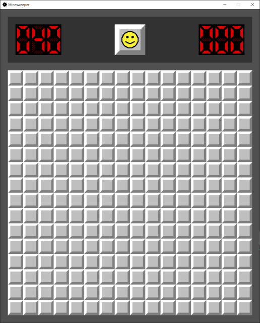
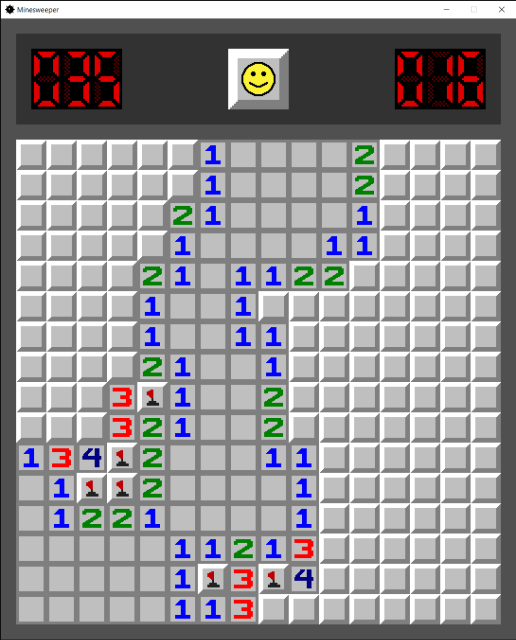
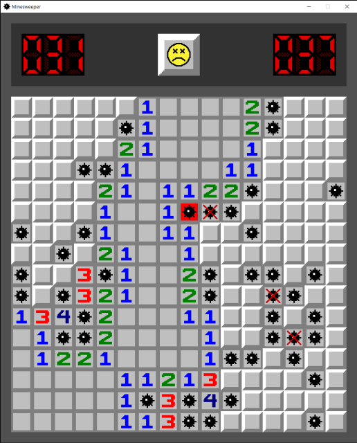

## Minesweeper-raylib

### Description

A classic Minesweeper clone, inspired by Windows XP Minesweeper. Made with [raylib](https://www.raylib.com/) and based on the [Raylib Setup using Premake5](https://github.com/raylib-extras/game-premake) template.

### Features

 - Flag counter
 - Timer
 - Chording (reveals all adjacent cells around the clicked cell, if the number of flags around that cell corresponds exactly to the number on the clicked cell)
 - Edit the [config.ini](config.ini) file to customize the difficulty to your liking

### Controls

 - Left click to open a cell
 - Right click to place a flag on a closed cell
 - Chording is done by pressing and releasing left click and right click at the same time, or by pressing the middle mouse button.
 - Pressing the ESC key quits the game

### Screenshots

### License

This game sources are licensed under an unmodified zlib/libpng license, which is an OSI-certified, BSD-like license that allows static linking with closed source software. Check [LICENSE](LICENSE) for further details.

*Copyright (c) 2023 Mattias Aksli (mattiasaksli)*
